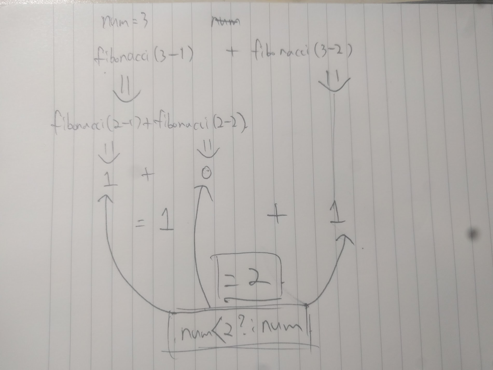

[Algorithm JavaScript] Level1. 피보나치 수

### Question

#### Source https://programmers.co.kr/learn/challenge_codes/6

> 피보나치 수는 F(0) = 0, F(1) = 1 일 때, 2 이상의 n 에 대하여 F(n) = F(n-1) + F(n-2) 가 적용되는 점화식입니다. 2 이상의 n 이 입력되었을 때, fibonacci 함수를 제작하여 n 번째 피보나치 수를 반환해 주세요. 예를 들어 n = 3 이라면 2 를 반환해주면 됩니다.

### My solution

```javascript
function fibonacci(num) {
  var newArr = [0, 1];
  for (let i = 2; i <= num; i++) newArr.push(newArr[i - 2] + newArr[i - 1]);
  return newArr[num];
}

// 아래는 테스트로 출력해 보기 위한 코드입니다.
console.log(fibonacci(3));
```

사실 피보나치 수열이라는 단어를 처음 볼 땐 매우 당황스러웠다. 심지어 나무위키를 봤을 때도 한 번에 이해되지가 않아서 더 당황했다. 수포자의 늪은 쉽게 빠져나올 수 있는게 아니다...

간단히 설명하자면 아래와 같다.

> 피보나치 수열이란, 첫 번째 항의 값이 0 이고 두 번째 항의 값이 1 일 때, 이후의 항들은 이전의 두 항을 더한 값으로 이루어지는 수열을 말한다.
>
> 예) 0, 1, 1, 2, 3, 5, 8, 13

나는 위 설명에 충실했다. 처음에 0 과 1 이 들어있는 배열을 만들었다. 그리고 해당 배열의 index 를 활용해 문제를 풀려고했다. 그래서 `i`는 2 로 정의해주고 인자로 받은 Number 값 만큼 반복문을 돌렸다. 반복이 돌아갈 때 마다 배열에 새로운 값을 `push`해줬고, 새로운 값은 문제 그대로 배열의 index `i-2`의 값과 `i-1`의 값을 더한 값으로 처리했다. 즉 배열에 이전이전 값과 이전 값을 더해준 값을 새로운 배열로 추가한다는 것!

그렇게 새로운 배열에 `push`를 해주면 피보나치 수열이 완성된 배열이 만들어진다. 그리고 그 배열의 마지막 수를 `return`하는 문제이기에 배열의 `index`에 인자로 받은 숫자를 넣어 해당 값이 나오도록 했다.

#### Other Solutions

#### Best of Best

> 잘만 활용한다면 최소한으로도 충분하다 -쥘 베른,'80 일간의 세계 일주' 중에서

```javascript
function fibonacci(num) {
  return num < 2 ? num : fibonacci(num - 1) + fibonacci(num - 2);
}

// 아래는 테스트로 출력해 보기 위한 코드입니다.
console.log(fibonacci(3));
```

사실 피보나치 수열 문제는 재귀함수의 1 번 예제로 많이 활용된다. 항상 언급했듯이 아름다운 함수에 재귀함수는 꼭 들어가있다. 항상 그렇게 마음에 새기면서도 재귀함수의 예시 1 번 문제를 풀 때 막상 생각을 하지 못했다. 반성!

먼저 삼항연산자를 활용했다. 조건은 ''인자로 받은 Number 값이 2 보다 작나?''이다. `true`라면 해당 숫자가 그대로 반환된다. 그리고 2 보다 클 경우 즉 `false`일 경우에 해당 피보나치 함수의 인자로 받은 Number 값의 각각 -1 과 -2 된 수가 인자로 들어간 피보나치 함수를 반환한다. 말로는 어렵다. 그림으로 풀자면 아래와 같다.



​ (그림이 매우 조악..;;)

재귀함수에 대해 설명이 잘 나와있는 [링크](http://webclub.tistory.com/72)(출처: 웹클럽)를 소개한다.
