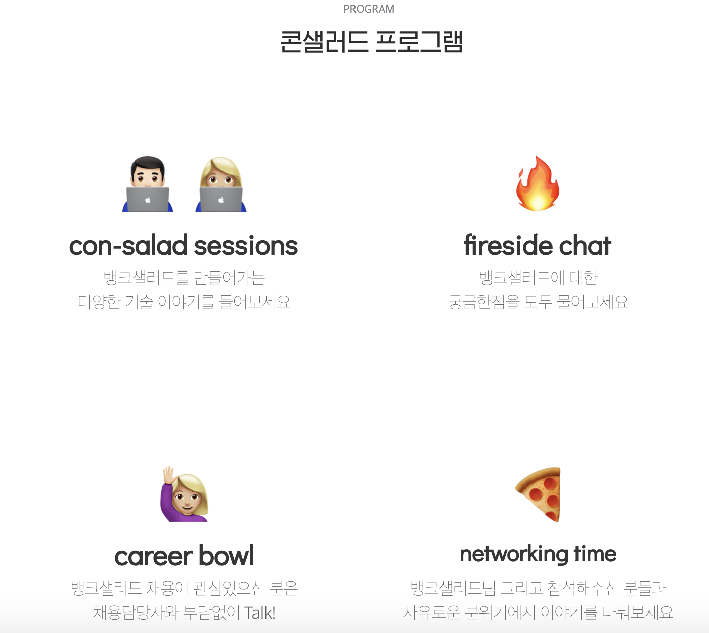
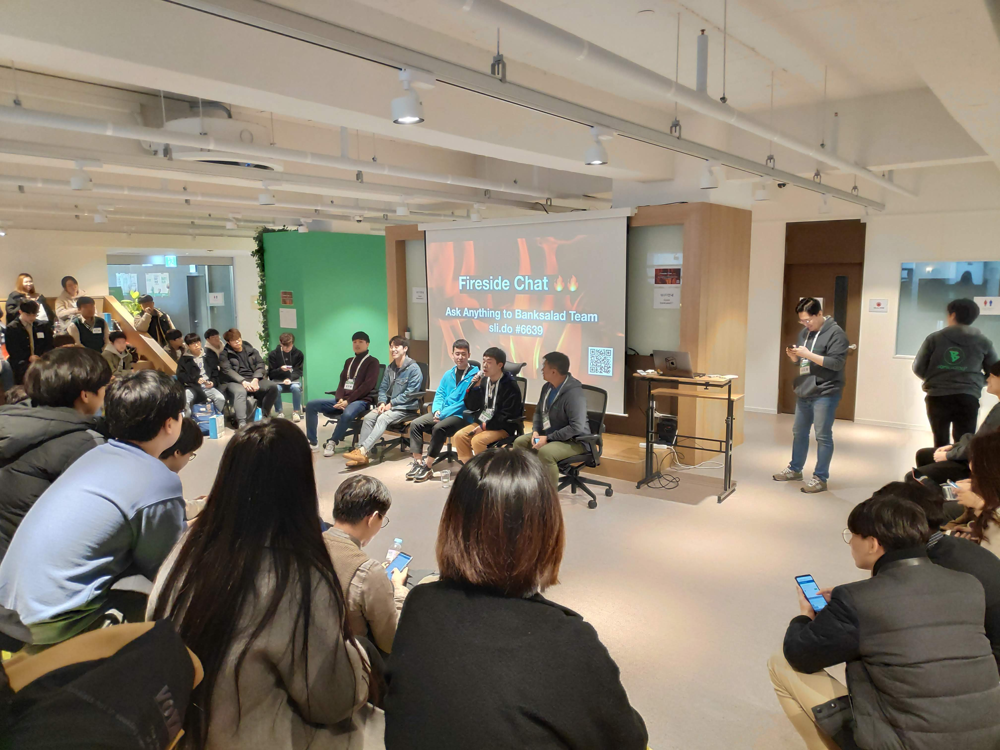

요즘 핫한 기업인 레이니스트에서 주최하는 세번째 콘샐러드에 참관했다.

콘샐러드는 레이니스트의 개발자분들이 뱅크샐러드를 만들어가면서 개발적으로 겪었던 에피소드를 공유하고 채용에 대해 자유롭게 이야기를 나눌 수 있는 컨퍼런스다.



<center>출처: 콘샐러드 홈페이지</center>

레이니스트는 대규모 투자를 받으면서 (특히 발표를 많이 하시는)유명한 개발자 분들을 많이 채용했다. 그래서 더욱 기대되었던 컨퍼런스였고 정말 한 분도 빠짐없이 다 발표를 잘해서 더 많이 놀랐던 컨퍼런스 였다.

프론트엔드 개발자이기 때문에 프론트엔드 관련 세미나에 대해서 간략하게 소개하려한다.

### 미리 맛보는 Modern JavaScript

ECMAScript 언어 표준과 TC39 위원회에 대한 이야기로 발표가 시작되었다. JavaScript의 여러 제안들이 실제 표준 스펙으로 정착되는 일련의 과정들에 대한 소개하는 시간이었다.
(ECMAScript 언어 표준과 TC39 위원회에 대한 소개는 [링크](https://ahnheejong.name/articles/ecmascript-tc39/)를 참고하세요.)

이후에 TC39 Proposal에 올라와있는 다양한 스펙들에 대해 소개하는 시간을 가졌다.

발표자분께서 실제 개발에도 적용한 **Optional Chaning**에 대해 먼저 소개해주셨다. 보통 API를 통해 JSON을 전달 받으면 depth가 굉장히 깊은 경우도 생긴다. 이때 각 depth별로 property의 유무를 계속 체크하면서 클라이언트에서 해당되는 값을 활용하는 경우가 생긴다. 이때 코드가 굉장히 여러모로 클린하지 않다.

```javascript
if (data.depthOne && data.depthOne.depthTwo && data.depthOne.depthTwo.value) {
  console.log(data.depthOne.depthTwo.value);
}
```

보통 위와 같은 경우가 생기는데 이러한 경우를 방지하기 위해 제안된 스펙이 **Optional Chaining**이다. Swift에서 동명의 스펙으로 활용되고 있다.

```javascript
if (data.depthOne?.depthTwo?.value) {
  console.log(data.depthOne.depthTwo.value);
}
```

활용하면 위와 같이 편리하고 간결하게 깊은 depth의 값 접근 및 활용이 가능해진다. 표준은 아니지만 [babel 플러그인](https://babeljs.io/docs/en/babel-plugin-proposal-optional-chaining)을 활용하면 polyfill로 사용이 가능하다.

그 외에도 Proposal 상태의 다양한 스펙([Class Fields(3단계)](https://github.com/tc39/proposal-class-fields), [Dynamic Import(3단계)](https://github.com/tc39/proposal-dynamic-import))에 대해 소개해주셨고 표준인 ECMA2019의 다양한 스펙([Array.flat()](https://developer.mozilla.org/en-US/docs/Web/JavaScript/Reference/Global_Objects/Array/flat) [Array.flatMap()](https://developer.mozilla.org/en-US/docs/Web/JavaScript/Reference/Global_Objects/Array/flatMap), [Optional Catch Binding](https://developer.mozilla.org/en-US/docs/Web/JavaScript/Reference/Statements/try...catch))들 또한 소개해주셨다.

이러한 다양한 새로운 스펙들에 대해 체크하고 실제로 현업에서 적용까지하는 사례를 보니 '힙하고 앞서가는 기업은 이런 문화부터 다르구나'라는 걸 느끼게 되었다. 물론 사용한 스펙이 표준이 되지 못했을때 기술부채가 될 수도 있다는 피드백도 충분히 공감되는 부분이었다.

#### 담대한 협업과 클린코드

이 발표는 비전공자 개발자로서 굉장히 공감이 많이 가는 발표였다. 사내에서 [클린코드](http://www.yes24.com/Product/Goods/11681152?scode=032&OzSrank=1)책을 스터디했던 내용들을 소개하고 실제 예시로 소개해주는 내용이었다.

처음에 본인을 **야생**개발자로 소개했는데 현재 내가 현업에서 개발하는 모습이랑 너무 비슷한 비유여서 공감하면서도 마음이 아팠었다.(ㅠㅜ)

발표 내용을 요약하자면 아래와 같다.

```
1. 깨끗한 코드
   - 문장처럼 읽힌다.(작성자가 아닌 사람이 봐도 문장처럼 읽힐 수 있는 코드 흐름)
2. 의미있는 이름
   - 의도를 드러내라.(의도가 명시적으로 드러나는 변수와 함수명)
3. 함수와 주석
   - 프로그래밍은 글짓기.(특히 주석은 깨끗한 코드 앞에서는 필요가 없고 쓰면 쓸수록 코드의 가독성이 떨어진다.)
4. 오류 처리
   - 논리에 집중해라.(로깅이나 에러코드는 실제 코어 기능의 코드와 뒤섞지 말고 구분해서 각자의 역할을 명확히 할 수 있도록 하자.)
```

사내에서 협업을 많이 하지 못하고 있기 때문에 위에 내용은 당연한 내용이지만 새롭고 충격적으로 다가왔다. 역시 사내에서 느끼지 못한 것을 컨퍼런스에서 깨닫은 이 순간은 외부 행사에 꼭 참석하게 되는 가장 큰 이유가 되겠다.

#### 마무리



개별 발표가 끝나고 파이어사이드챗과 네트워킹 행사를 경험하면서 레이니스트의 구성원들의 커뮤니케이션 능력에 감탄을 할 수 밖에 없었다. 기획자는 없지만 활동적이고 커뮤니케이션 능력이 뛰어난 소수의 개발자들이 만들어나가는 이 서비스가 어디까지 성장할 수 있을까?라는 기대를 하게 만드는 시간이었다.

그리고 야생개발자로 살아가고 있는 지금 너무 안일하게 생각하고 개발을 이어가고 있는 나 자신에게 큰 반성에 시간을 주는 뜻깊은 시간이기도 했다.

출처

[ECMAScript와 TC39](https://ahnheejong.name/articles/ecmascript-tc39/)

[MDN](https://developer.mozilla.org/en-US/)
